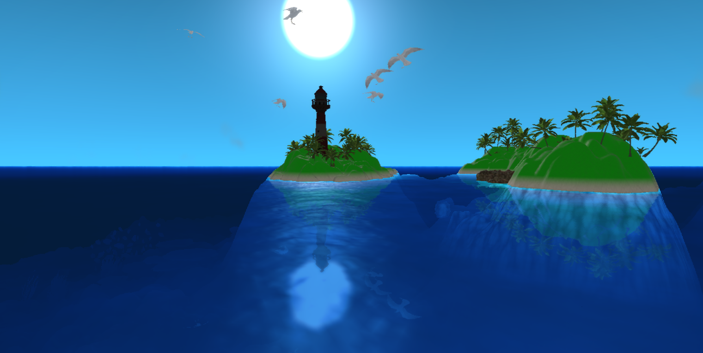
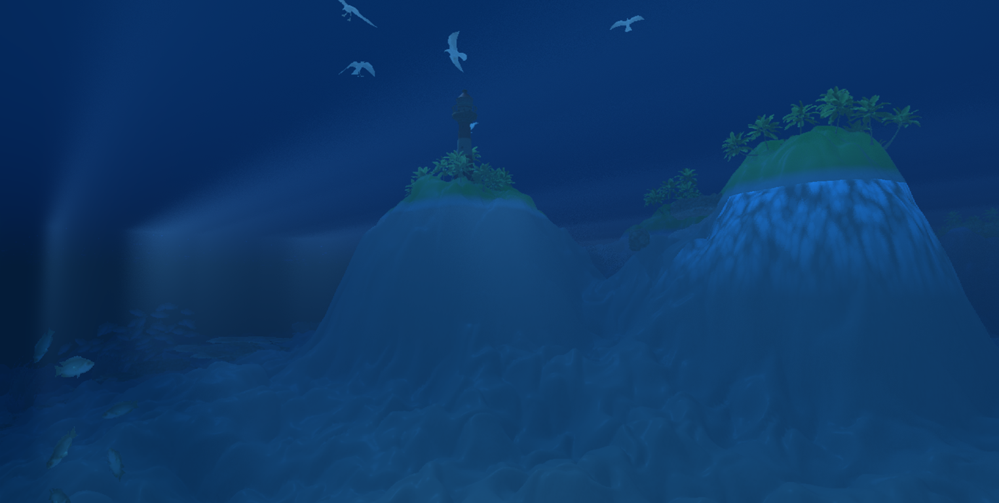
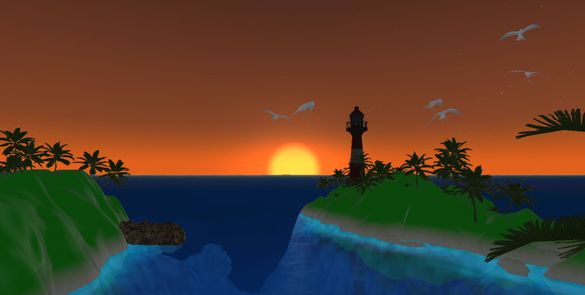
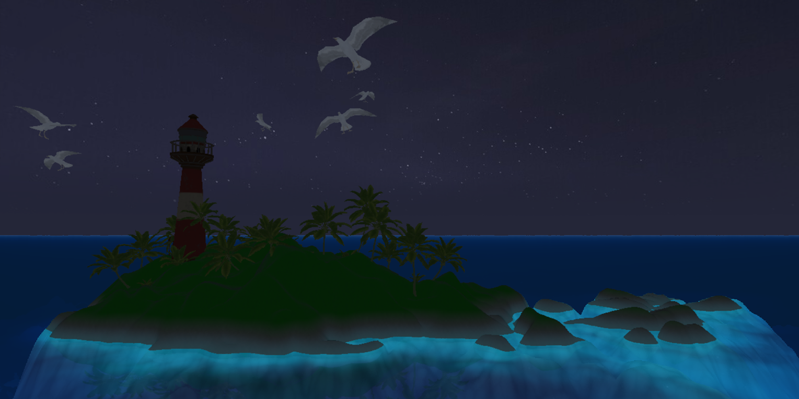
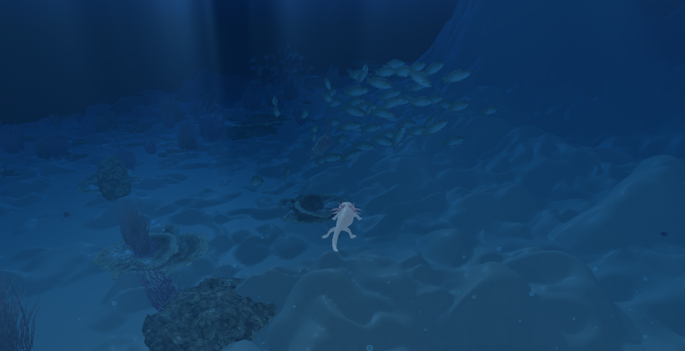
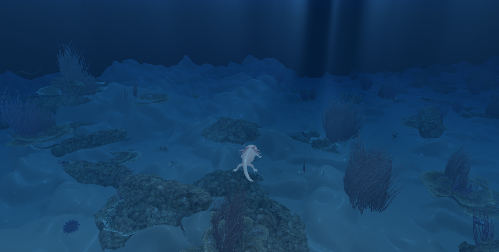
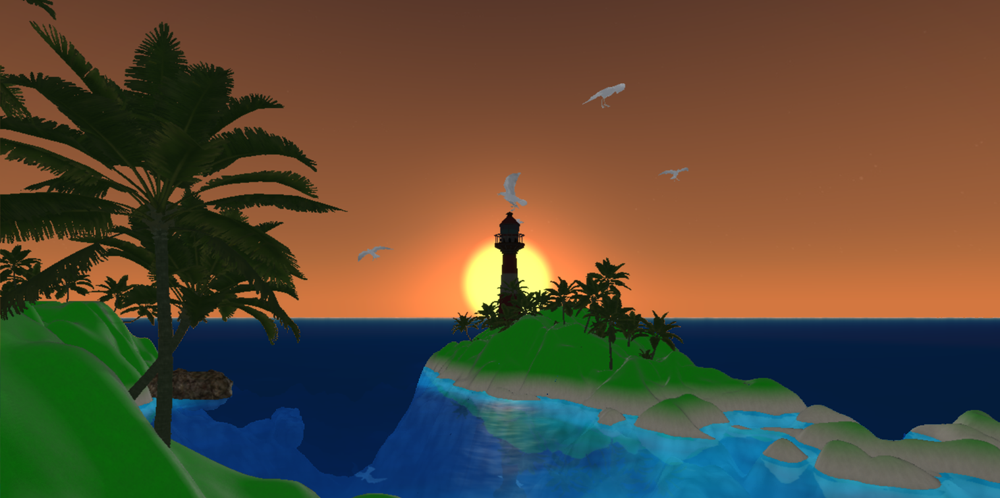
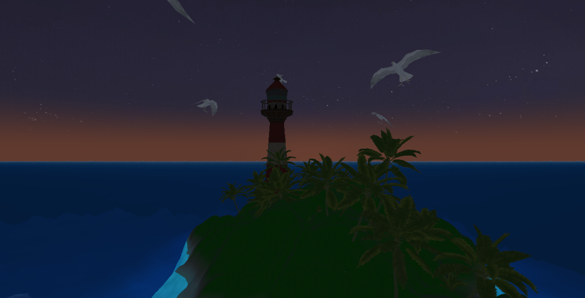

# Scena podwodna - OpenGL / GLSL C++

Projekt zaliczeniowy GRK 2026. Aplikacja 3D w C++/OpenGL/GLSL przedstawiająca scenę podwodną z terenem, rafą, stworzeniami, latarnią, wodą z odbiciem/załamaniem, cząstkami i post-processingiem.

## Skład grupy

- Ruslan Trytsetskyi
- Daniel Stodulski
- Martyna Plenzer

## Screenshoty

<p align="center">
  
  
</p>
<p align="center">
  
  
</p>
<p align="center">
  
  
</p>
<p align="center">
  
  
</p>

## Wybrane metody A/B

Kombinacja zgłoszona w projekcie:

- A10 - Skeletal animation lub vertex-shader swimming animation
- B04 - Fish/submarine movement along a spline path

## Metody obowiązkowe

| Metoda obowiązkowa | Status | Gdzie w kodzie |
|---|---|---|
| Normal mapping | Zaimplementowane | `shaders/worldmesh_vertex.glsl` (TBN), `shaders/worldmesh_fragment.glsl` (sandNormal + grassNormal), `shaders/reef_fragment.glsl` (normalMap + perturbacja TBN z pochodnych) |
| PBR lighting (metallic/roughness) | Zaimplementowane | `shaders/worldmesh_fragment.glsl`, `shaders/axolotl_fragment.glsl`, `shaders/reef_fragment.glsl` (GGX + Fresnel + metallic/roughness) |
| Quaternion camera control | Zaimplementowane | `headers/camera.h`, `src/camera.cpp` (`glm::quat`, obrót przez `angleAxis`, orientacja bez gimbal lock) |
| Shadow mapping | Zaimplementowane | `src/application.cpp` (`Init_Shadow`, `ShadowPass`), shadery obiektów i terenu używają `shadowMap` + PCF 3x3 i bias |
| Parallel Transport Frames | Zaimplementowane | `src/axolotl.cpp` (PTF dla orientacji stworzeń na splajnie), `src/tube.cpp` (transport ramki wzdłuż krzywej przy generacji rury) |
| Underwater skybox/cubemap | Zaimplementowane | `src/cubemap.cpp` (cubemap), `src/application.cpp` (przełączanie C), widok bez translacji kamery przez `mat3(view)` |

## Metody dodatkowe z list A/B
| ID | Metoda z PDF | Status | Gdzie w kodzie |
|---|---|---|---|
| A10 | Skeletal animation / vertex-shader swimming animation | Zaimplementowane | `shaders/axolotl_vertex.glsl` (deformacja pływania), `src/otter.cpp` + `shaders/otter_vertex.glsl` (skinning ottery) |
| A01 | Volumetric underwater light shafts / single scattering | Zaimplementowane | `shaders/postprocess_fragment.glsl` (ray-marched volumetric shafts), `src/application.cpp` (parametry pozycji słońca na ekranie) |
| A06 | Screen-space refraction/reflection | Zaimplementowane | `src/application.cpp` + `src/waterFrameBuffers.cpp` (render-to-texture reflection/refraction), `shaders/watermesh_fragment.glsl` (mieszanie reflection/refraction) |
| B04 | Ruch po splajnie | Zaimplementowane | `src/axolotl.cpp` (zamknięte ścieżki Catmull-Rom + orientacja) |
| B09 | Loading and displaying OBJ models | Zaimplementowane | `src/objloader.cpp`, `src/monument.cpp`, `src/islandPalms.cpp`, `src/reef.cpp` (parsery OBJ i render modeli) |
| B10 | Depth-based fog and color attenuation | Zaimplementowane | `shaders/postprocess_fragment.glsl` (attenuacja koloru i fog zależny od dystansu pod wodą) |
| B13 | Moving point lights / headlights | Zaimplementowane | `src/application.cpp` (toggle L), `src/axolotl.cpp` (`HeadlightPosition`), użycie w shaderach terenu/rafy/stworzeń |
| B14 | Simple creature animation state machine | Zaimplementowane | `src/otter.cpp` (stany `WANDER/HUNGRY/CHASE/ATTACK`) |
| B01 | CPU-side particle system for bubbles | Zaimplementowane | `src/particles.cpp` (aktualizacja CPU: pozycja, prędkość, respawn/wrap) |
| B02 | Billboarded plankton / sea snow | Zaimplementowane | `src/particles.cpp` + `shaders/particle_vertex.glsl` / `shaders/particle_fragment.glsl` |
| B03 | Animated procedural caustic texture | Zaimplementowane | `shaders/postprocess_fragment.glsl` (animowane kaustyki) |

## Dodatkowe elementy renderingu spoza listy A/B

- Volumetric underwater light shafts (god rays) w post-process: `shaders/postprocess_fragment.glsl`
- Reflection/refraction powierzchni wody (FBO): `src/application.cpp`, `src/waterFrameBuffers.cpp`, `shaders/watermesh_fragment.glsl`
- LOD + frustum culling dla terenu: `src/worldmesh.cpp`
- LOD0 selekcja i rozproszenie wielu modeli rafy: `src/reef.cpp`

## Sterowanie

### Kamera i nawigacja

| Klawisz | Akcja |
|---|---|
| Mysz | Obrót kamery |
| W/S/A/D | Ruch kamery |
| Q/E | Góra/dół |
| F11 | Fullscreen |
| G | Preset kamery przy latarni |
| H | Look-at najbliższego stworzenia / ryby (przełączane) |

### Interakcje sceny (poza kamerą)

| Klawisz / akcja | Efekt |
|---|---|
| L | Włącz/wyłącz reflektor |
| 5 / 6 | Zmniejsz / zwiększ gęstość mgły |
| 7 / 8 | Zmniejsz / zwiększ prąd wodny |
| Spacja | Pauza / wznowienie ruchu axolotli |
| Strzałka Góra / Dół | Zmień prędkość axolotli |
| Lewy przycisk myszy | "Poke" - przyspiesza najbliższego axolotla w punkcie celowania |
| C | Przełącz cubemap/skydome |
| R | Przełącz odbicia/załamania wody |
| 1 / 2 | Roughness terenu - / + |
| 3 / 4 | Metallic terenu - / + |
| O | Przełącz klip animacji ottery |
| P | Powrót ottery do sterowania przez state machine |

## Budowanie

Wymagania:

- CMake
- Kompilator C++20 (MSVC/Visual Studio)

Polecenia:

```bash
cmake -B build
cmake --build build --config Release
```

Uruchomienie:

- `build/Release/computer_graphics.exe`

## Struktura projektu

- `src/`, `headers/` - logika aplikacji C++
- `shaders/` - shadery GLSL
- `assets/` - modele, tekstury, cubemap, heightmap

## Źródła i licencje zasobów

- Skybox "FREE - SkyBox Basic Sky" (Sketchfab, CC-BY-4.0)
- Nature Assets - Marine Biome (CGTrader, Royalty Free)
- Pozostałe assety: zgodnie z licencjami w katalogach źródłowych i materiałach grupy
